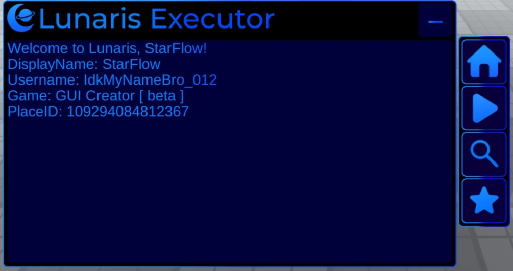
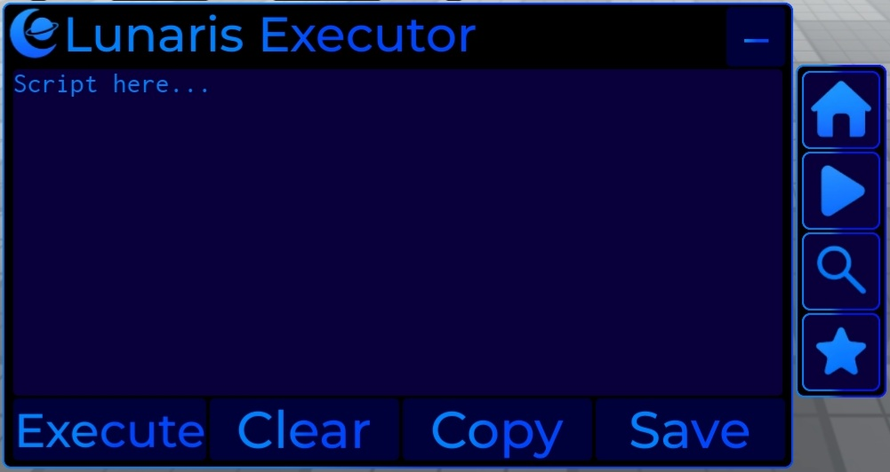
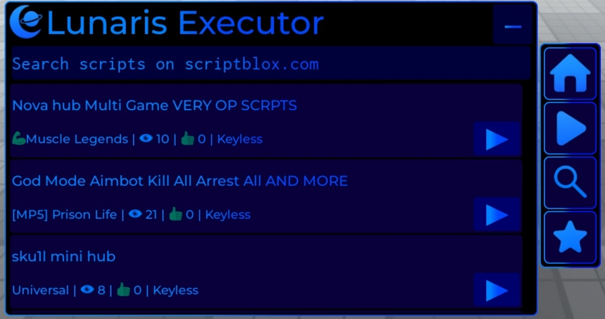
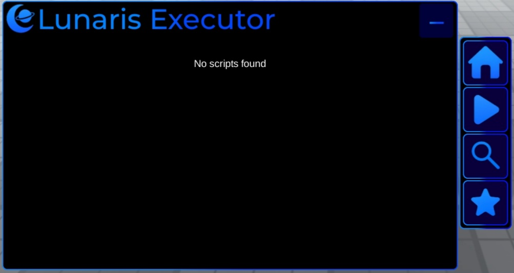

# Lunaris Executor

You execute Lunaris using a normal executor via
loadstring(game:HttpGet(...))()

---

<details>
  <summary>Explanation</summary>

Lunaris works by being executed inside an existing Roblox executor.

It does not bypass anything and does not add new exploit capabilities.
</details>


<details>
  <summary>Images</summary>

Home tab:<br>

Executor tab:<br>

Search tab:<br>

Favorites tab:<br>


<details>
  <summary>Loader</summary>  
  
```
loadstring(game:HttpGet("https://raw.githubusercontent.com/its-starflow/Scripts/main/Executor/Lunaris/.luau"))()
```
<details>


<details>
  <summary>Credits</summary>Made by StarFlow in 3 days.<br><br>Profiles:<br><a href="https://scriptblox.com/u/starflow">   
</a><br><a href="https://www.youtube.com/@StarFlow.0">
  
</a>  
</details>
